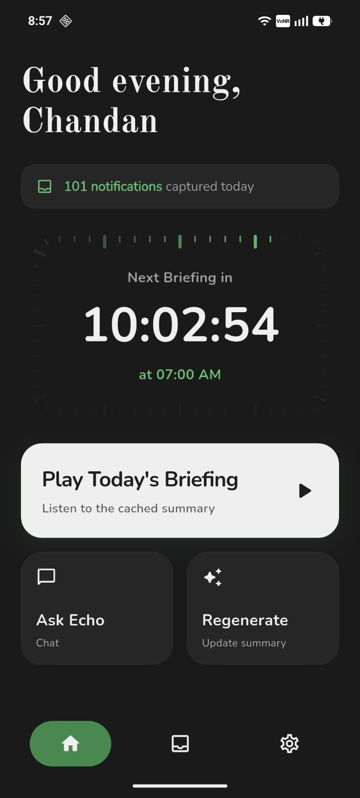
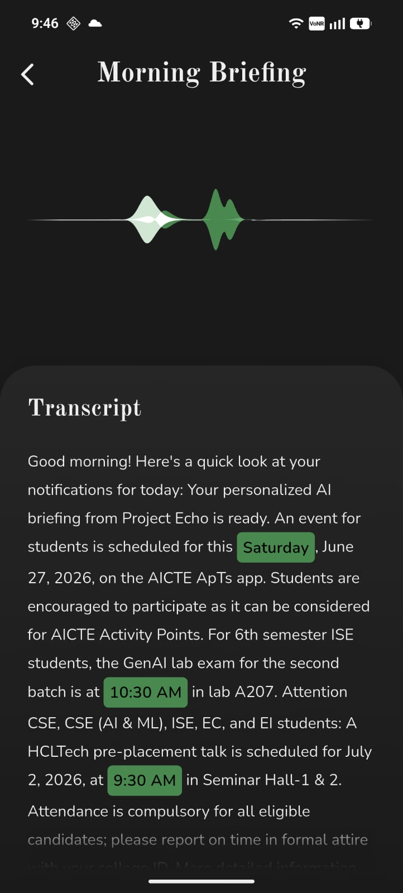
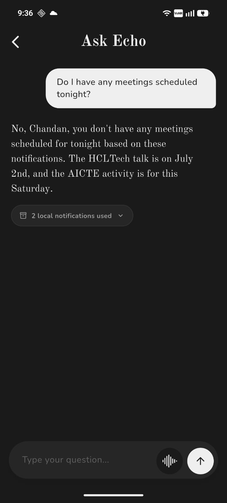
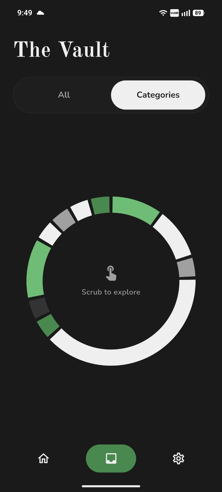
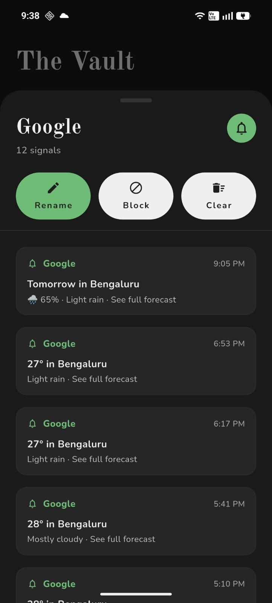
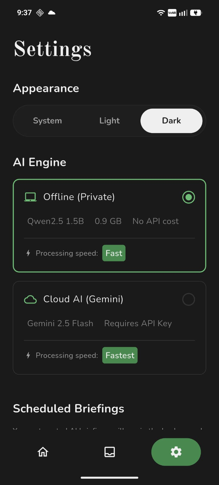

<div align="center">
  
  <h1>Echo</h1>
  <p>Echo passively monitors your notifications, SMS, and calendar — then delivers a concise spoken daily briefing, on-device or in the cloud, privately and on your terms.</p>
</div>

---

## 📸 Screenshots

| Home | Daily Briefing | Ask Echo |
|:----:|:--------------:|:--------:|
|  |  |  |

| The Vault | Vault Detail | Settings |
|:---------:|:------------:|:--------:|
|  |  |  |

---

## 🧠 What is Echo?

Echo is a privacy-first AI assistant for Android that quietly collects signals from your daily digital life — notifications, SMS, and calendar events — and synthesises them into a **spoken morning briefing** delivered each day at a time you choose.

Unlike cloud-first assistants, **no data ever leaves your device by default**. All AI processing can run entirely offline using a quantised on-device language model (Qwen2.5 1.5B). Echo also optionally supports Gemini 2.5 Flash via an API key for faster, cloud-powered responses.

---

## ✨ Features

### 🔔 Passive Signal Collection
Echo runs silently in the background, reading incoming notifications from all apps and building a structured knowledge store throughout the day. Every signal is stored locally in an on-device database.

### 📻 Daily Spoken Briefing
At your scheduled time(s), Echo uses AI to synthesise all captured signals into a concise, natural language briefing — then reads it aloud using on-device text-to-speech. Timestamps and key events are highlighted inline in the transcript.

### 🤖 Dual AI Engine
Choose how Echo thinks:
- **Offline (Private)** — runs Qwen2.5 1.5B (0.9 GB) locally on your device. No internet required after initial model download. Zero API costs.
- **Cloud AI (Gemini)** — uses Gemini 2.5 Flash via your personal Google AI Studio API key. Fastest responses, requires Wi-Fi/data. Your key is stored securely on-device.

### 💬 Ask Echo
An AI chat interface that lets you query your day's notifications in natural language. Echo understands context from your local notification vault — ask things like *"Do I have meetings tonight?"* or *"What did WhatsApp say?"* Echo answers using only the signals it has captured for the day.

### 🗄️ The Vault
A chronological store of every notification Echo has seen. Notifications are grouped by app/sender into categories. Use the interactive **pie chart scrubber** to explore by category, or view the full chronological list. Each sender can be renamed, blocked, or cleared.

### ⚙️ Settings
- **Appearance** — System / Light / Dark theme
- **AI Engine** — Switch between Offline and Cloud modes at any time; validate and update your Gemini API key
- **Scheduled Briefings** — Add or remove briefing times throughout the day (e.g. 7:00 AM, 1:00 PM)

---

## 🔒 Privacy

**No data is collected from the app.** Your data stays entirely on your device and is only sent to Cloud AI if you explicitly choose it.

Echo is built with a local-first philosophy:
- All notifications, SMS, and calendar data are stored in an encrypted on-device [Isar](https://isar.dev) database.
- API keys (if used) are stored using Android Keystore via Flutter Secure Storage — never in plain text.
- The on-device LLM (Qwen2.5 1.5B) runs fully sandboxed with no network access.

---

## 🛡️ Permissions

Echo requests the following Android permissions and explains exactly why each is needed:

| Permission | Why it's needed |
|:-----------|:----------------|
| `INTERNET` | Required to download the AI model from HuggingFace during setup, and to contact the Gemini API if Cloud AI is selected. |
| `POST_NOTIFICATIONS` | Required on Android 13+ to display briefing ready and alarm notifications. |
| `READ_CALENDAR` | Reads today's calendar events so Echo can include your schedule in the daily briefing. |
| `WRITE_CALENDAR` | Required by the Android calendar provider alongside read access. No events are created or modified. |
| `READ_SMS` | (Optional) Reads incoming SMS messages as additional signals for the briefing. This permission can be skipped during onboarding. |
| `RECEIVE_SMS` | (Optional) Required alongside READ_SMS for the SMS listener service. |
| `RECORD_AUDIO` | Enables voice input for the "Ask Echo" chat interface. |
| `RECEIVE_BOOT_COMPLETED` | Re-schedules daily briefing alarms after the device restarts. |
| `WAKE_LOCK` | Prevents the device from sleeping while generating the AI briefing in the background. |
| `SCHEDULE_EXACT_ALARM` / `USE_EXACT_ALARM` | Ensures briefings are triggered at the exact scheduled time. |
| `FOREGROUND_SERVICE` / `FOREGROUND_SERVICE_DATA_SYNC` | Allows the model download to continue reliably in the foreground without being killed by the OS. |
| `BIND_NOTIFICATION_LISTENER_SERVICE` | The core permission that allows Echo to passively read notifications from all apps. Granted via a special system settings page — Echo will guide you there. |

> **SMS permission is optional.** Notifications and Calendar access are required to continue through onboarding. SMS can be skipped.

---

## 🏗️ Tech Stack

| Layer | Technology |
|:------|:-----------|
| Framework | Flutter (Dart) |
| State Management | flutter_bloc (Cubit) |
| Navigation | go_router |
| On-device LLM | [fllama](https://github.com/Chandan-GS/fllama_patch) — llama.cpp via FFI |
| Cloud AI | Google Gemini 2.5 Flash (`google_generative_ai`) |
| Local Database | Isar |
| Secure Storage | flutter_secure_storage (Android Keystore) |
| Background Tasks | workmanager + android_alarm_manager_plus |
| On-device Embeddings | TFLite (all-MiniLM-L6-v2) |
| Text-to-Speech | flutter_tts |
| Speech-to-Text | speech_to_text |
| Fonts | OldStandardTT (headings), Nunito (body) — loaded from local assets |

---

## 🚀 Getting Started

### Prerequisites
- Flutter SDK ≥ 3.11.5
- Android device or emulator (API 26+)
- ~1 GB free storage for offline model (optional)
- Google AI Studio API key for Cloud AI mode (optional)

### Setup

```bash
git clone https://github.com/Chandan-GS/Echo.git
cd Echo

flutter pub get

# Run in debug mode
flutter run

# Build a release APK
flutter build apk --release
```

### First Launch
1. Grant **Notification Listener** access when prompted.
2. Grant **Calendar** access.
3. Choose your AI engine: **Offline** (download the Qwen2.5 model, ~0.9 GB) or **Cloud AI** (enter your Gemini API key).
4. Echo is ready. Your first briefing will play at your scheduled time.

---

## 📁 Project Structure

```
lib/
├── core/
│   ├── presentation/      # Shared widgets (EchoButton, ChipLabel, etc.)
│   ├── routes/            # GoRouter app router
│   ├── services/          # Gemini service, notification service, scheduler
│   └── theme/             # AppTheme, AppColors, local font shim
├── features/
│   ├── echo/              # Briefing, Ask Echo, waveform visualiser
│   ├── onboarding/        # Welcome, permissions, AI mode, name input
│   ├── settings/          # Appearance, engine, scheduled times
│   └── vault/             # Notification store, pie chart, category detail
assets/
├── fonts/                 # OldStandardTT & Nunito local font files
├── icons/
└── logo.png
docs/                      # Screenshots
```

---
