<div align="center">
  
  <h1>Echo</h1>
  <p><b>Your day, heard.</b></p>
  <p>Echo reads the notifications on your phone, from WhatsApp, Slack, Teams, Gmail and the rest, and tells you what matters: a short spoken briefing, who's waiting on you, and a to-do list that writes itself. On your phone and on your desktop, privately.</p>
  <p><a href="https://echo-mobileapp.vercel.app">Website</a> · <a href="https://echo-mobileapp.vercel.app/privacy/">Privacy policy</a></p>
</div>

---

## Screenshots

| Home | Briefing | Ask Echo | A drafted reply |
|:----:|:--------:|:--------:|:---------------:|
| 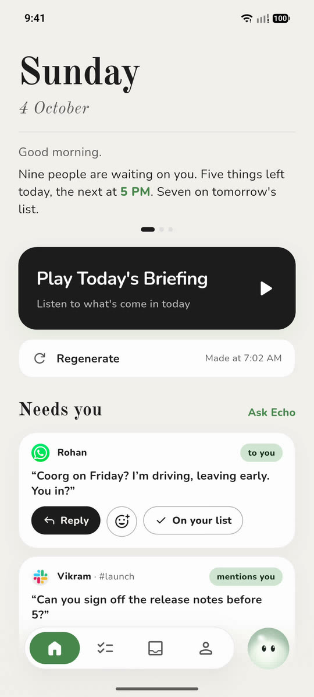 | 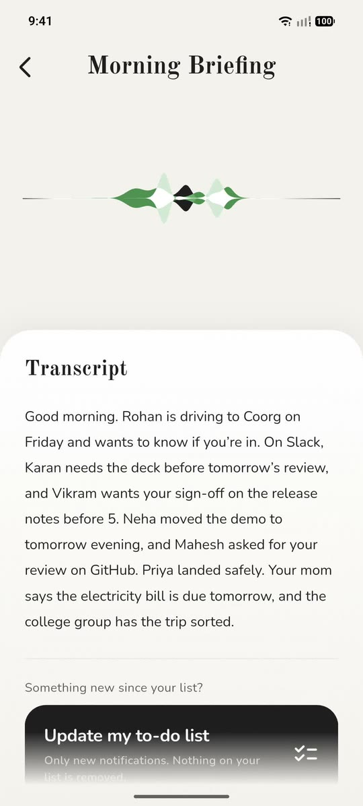 | 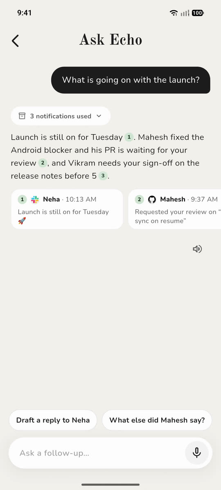 | 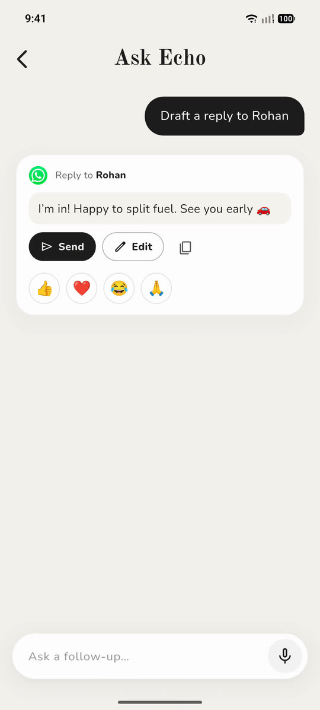 |

| To-do | Vault | Profile |
|:-----:|:-----:|:-------:|
| 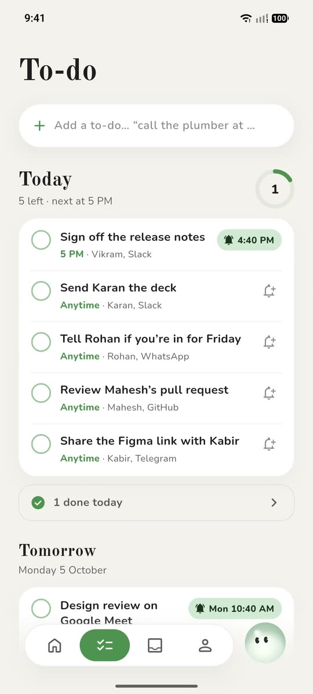 | 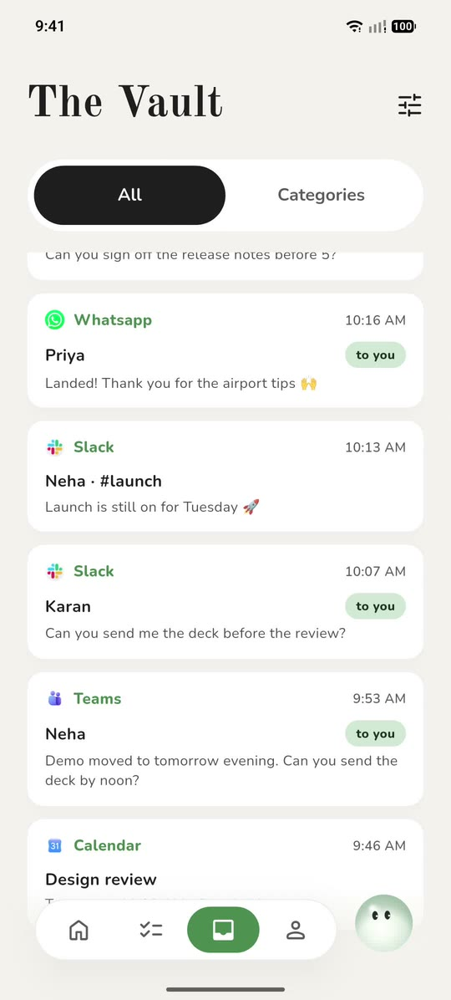 | 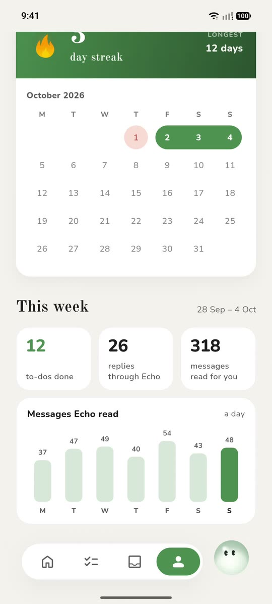 |

**On the desktop**

| Today | Ask Echo |
|:-----:|:--------:|
| 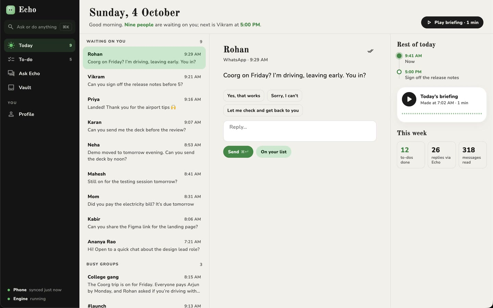 | 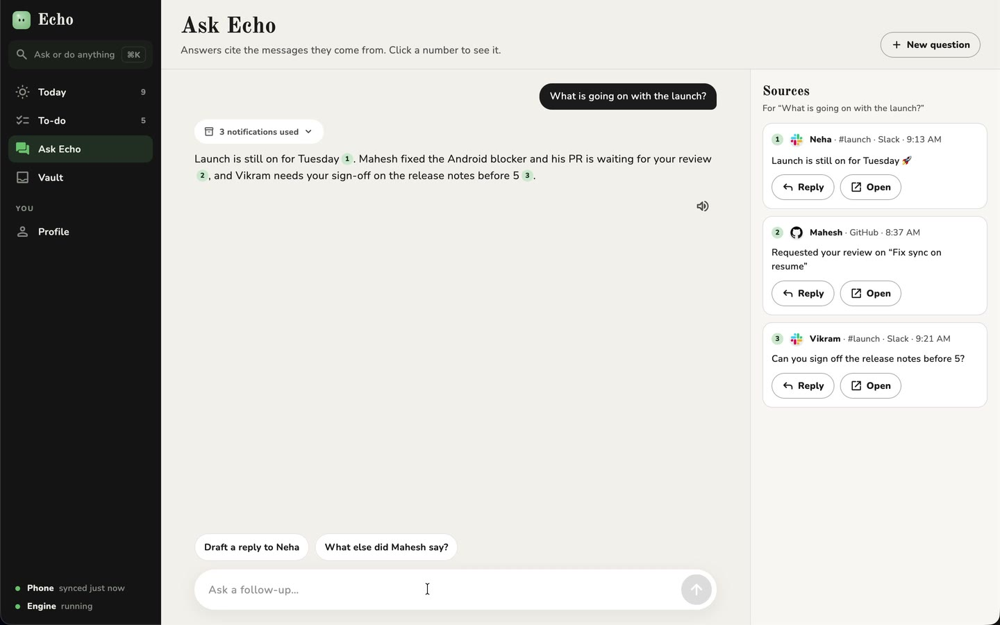 |
| **To-do** | **Vault** |
| 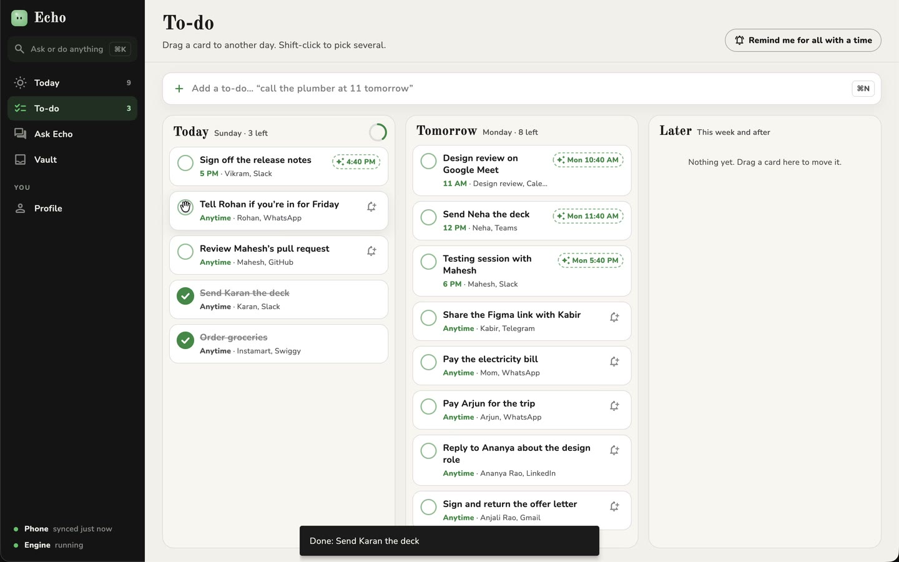 | 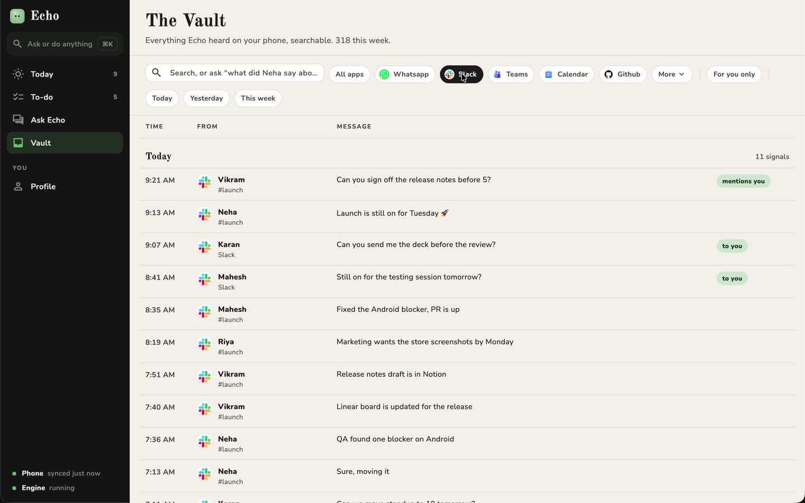 |

---

## What Echo does

**Home.** Who needs you, and what they asked: messages meant for you (sent to you, mentioning you, or replying to you), each with Reply, a one-tap emoji, and a reminder. Busy groups you weren't addressed in are summed up in a line each, and what's next on your list sits underneath.

**The briefing.** At the times you choose, Echo reads the whole day for you, drops the noise and speaks the rest, covering today and tomorrow. It speaks with one of four natural voices (Aria, Sage, Atlas, Nova, in American or British English) that run on the phone, or with the phone's own voice.

**Ask Echo.** Ask anything about your day and Echo answers from your own notifications, showing which ones it used. Ask it to reply to someone and it drafts the message; nothing is sent until you tap Send, and it goes from your own account in that app.

**To-do and reminders.** What people ask of you becomes a to-do, with who asked and where. Echo suggests a reminder time for each one that names a time; the reminder notification opens the exact chat it came from, or snoozes, or ticks it off.

**The Vault.** Everything Echo heard, by app and category, with the week's activity at a glance. Switch an app off and Echo leaves it out of your briefing, your list and your answers.

**Profile.** A streak for every morning you listen, and the week in three numbers: to-dos done, replies sent, messages read for you.

**Echo on the desktop.** Echo for Mac and Windows is a workspace of its own, not the phone made bigger: clear your day from the keyboard (J/K to move, ⌘↵ to send), ask from anywhere with ⌘K, see every answer's sources beside it, and drag to-dos between days. The phone shares your day with it directly over your Wi-Fi, and replies you send there go out through your phone.

## Two engines

| | On your devices (default) | Cloud (optional) |
|:--|:--|:--|
| Model | Qwen2.5 1.5B on the phone, Qwen2.5 7B on the desktop, via llama.cpp ([fllama](https://github.com/Chandan-GS/fllama_patch)) | Google Gemini (Flash-Lite by default), with your own API key |
| Where your content goes | Nowhere: it never leaves your devices | Straight from your device to Google's Gemini API |
| Needs | A one-time model download (about 0.9 GB on the phone) | A key from Google AI Studio |

You can switch at any time in Settings.

---

## Privacy

Echo has no server of its own and no account. In short:

- Captured notifications and calendar events are kept in a local [Isar](https://isar.dev) database in Echo's private storage, and cleared automatically after a day unless they concern something still ahead (never longer than 180 days).
- Content goes to Google only if you turn on the cloud engine. Your Gemini key is kept in Echo's private app storage and sent only to Google.
- A paired desktop receives your day directly over the local network, authenticated with the pairing code. The connection is plain HTTP, so pair on a network you trust.
- Voice questions use the phone's speech recognition service (usually Google's).
- Echo sends anonymous usage counts (which features are used, never any content) to [Aptabase](https://aptabase.com). They're on by default and can be turned off in Settings → Privacy.

The full [privacy policy](https://echo-mobileapp.vercel.app/privacy/) covers every permission and connection.

## Permissions (Android)

| Permission | Why |
|:--|:--|
| Notification access (`BIND_NOTIFICATION_LISTENER_SERVICE`) | Reads incoming notifications. Echo's central function; granted in system settings, which onboarding opens for you. |
| `READ_CALENDAR` | Today's and tomorrow's events, for the briefing and Ask Echo. (`WRITE_CALENDAR` comes with it on Android; Echo never changes your calendar.) |
| `POST_NOTIFICATIONS` | Your briefing and reminders. Asked in onboarding, and optional. |
| `RECORD_AUDIO` | Speaking a question to Ask Echo. |
| `CAMERA` | Scanning the QR code that pairs your desktop. |
| `READ_CONTACTS` | Only to find a WhatsApp chat when replying to it; asked on first use, and optional. |
| `INTERNET` | Model and voice downloads, the cloud engine, desktop pairing, and usage counts. |
| `RECEIVE_BOOT_COMPLETED`, `WAKE_LOCK` | Keeping briefing and reminder alarms after a restart, and finishing a briefing in the background. |

Echo doesn't read SMS directly (texts reach it as notifications), uses inexact alarms rather than the exact-alarm permission, and runs no foreground service.

---

## Getting started

**Needs:** Flutter (Dart SDK ^3.11.5), an Android device on Android 8.0 (API 26) or later, and optionally a Mac or Windows PC for the desktop app.

```bash
git clone https://github.com/Chandan-GS/Echo.git
cd Echo
flutter pub get

flutter run                 # on a connected Android phone
flutter run -d macos        # the desktop app (or -d windows)
flutter build apk --release
```

On first launch, onboarding walks through notification access, calendar, notifications, the apps Echo hears, the engine (download the on-device model or add a Gemini key), your name, tone and voice, then plays a sample briefing.

To use the desktop app, turn on **Run Echo Engine on this computer** in its Settings, then scan the QR code it shows from the phone's Settings → Desktop engine.

**Tests:** `flutter test`. The render tests under `test/render/` only run when asked (see each file's header).

**The demo build.** A scripted day used to film Echo, with made-up people and messages, installed beside the real app:

```bash
ECHO_DEMO=1 flutter run --dart-define=ECHO_DEMO=true
```

---

## Project structure

```
lib/
├── core/
│   ├── presentation/   shared widgets, motion (AppMotion), the splash hand-over (LaunchEcho, LaunchWake)
│   ├── routes/         go_router
│   ├── services/       notifications, scheduling, reminders, voice (Piper), Gemini, desktop sync
│   └── theme/          colours, type
├── demo/               the scripted demo day
└── features/
    ├── echo/           Home, briefing, Ask Echo, the mascot, replies
    ├── todo/           the to-do list and reminders
    ├── vault/          everything Echo heard, apps Echo hears
    ├── profile/        streak and the week
    ├── settings/       engine, voice, briefings, desktop pairing, privacy
    ├── onboarding/     first launch
    └── desktop/        the desktop workspace
packages/echo_native/   Android plugin: the notification buffer and calendar query
android/ ios/ macos/ windows/
assets/                 fonts, the embedding model, voice samples, logo
tool/brand/             draws every app icon (see its README)
store_assets/           Play Store icon and graphics
docs/                   README images
```

## Tech stack

| | |
|:--|:--|
| App | Flutter, flutter_bloc, go_router |
| On-device AI | llama.cpp via fllama (Qwen2.5), TFLite (all-MiniLM-L6-v2 embeddings) |
| Cloud AI | Google Gemini (`google_generative_ai`) |
| Storage | Isar, shared_preferences |
| Voice | Piper voices via sherpa-onnx, flutter_tts, speech_to_text, audioplayers |
| Scheduling | android_alarm_manager_plus, native Android alarms for reminders |
| Desktop pairing | local HTTP + UDP discovery, mobile_scanner for the QR code |
| Usage counts | Aptabase |
| Type | Old Standard TT and Nunito, bundled |
